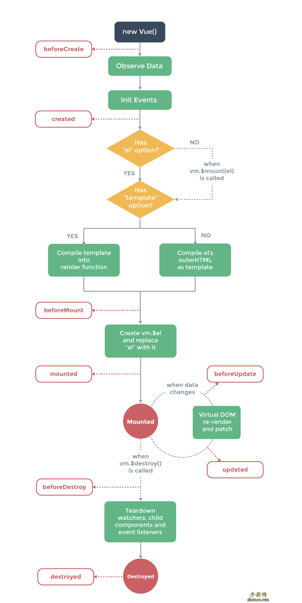
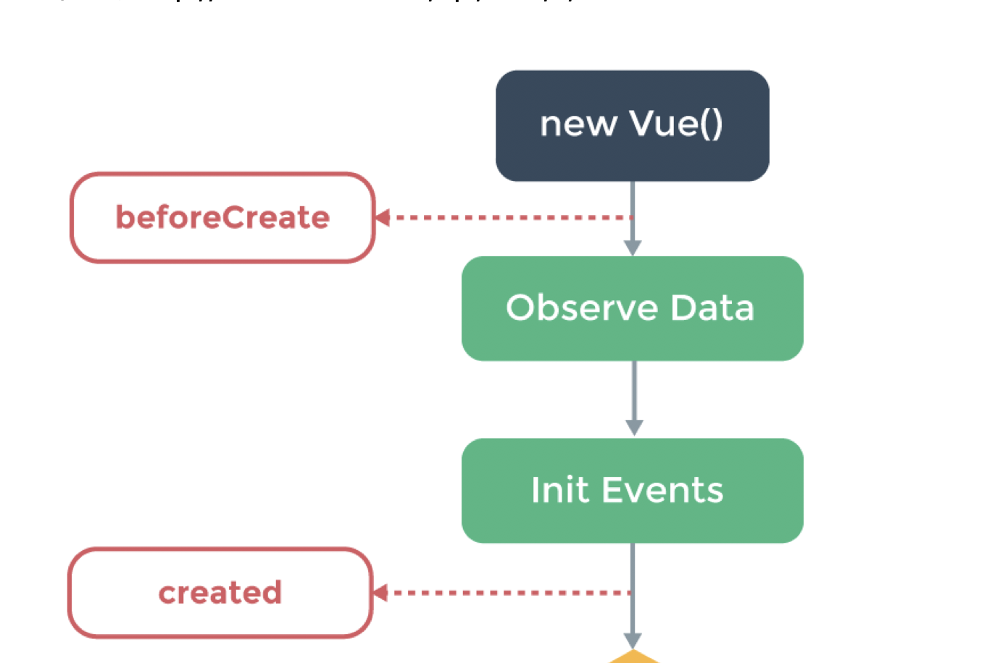

# 生命周期
我们很熟悉Vue的生命周期了，如图：

下面我们就源码来分析是怎么回事吧。

# 代码
```
export function initLifecycle (vm: Component) {
  const options = vm.$options

  // locate first non-abstract parent
  let parent = options.parent
  if (parent && !options.abstract) {
    while (parent.$options.abstract && parent.$parent) {
      parent = parent.$parent
    }
    parent.$children.push(vm)
  }

  vm.$parent = parent
  vm.$root = parent ? parent.$root : vm

  vm.$children = []
  vm.$refs = {}

  vm._watcher = null
  vm._inactive = null
  vm._directInactive = false
  vm._isMounted = false
  vm._isDestroyed = false
  vm._isBeingDestroyed = false
}
```
初始化`$children、$parent、$root、$refs、_watcher、_directInactive...`等参数。这就完了?是的，这里只做状态的初始化操作，具体的生命周期钩子函数需要在lifecycleMixin中进行。还记得这段代码吗？

```
function Vue (options) {
  if (process.env.NODE_ENV !== 'production' &&
    !(this instanceof Vue)
  ) {
    warn('Vue is a constructor and should be called with the `new` keyword')
  }
  this._init(options)
}

initMixin(Vue)
stateMixin(Vue)
eventsMixin(Vue)
lifecycleMixin(Vue)
renderMixin(Vue)
```
我们可以猜想initMixin的中_init方法所做的是初始化vue实例的相应属性，具体的实现是mixin中进行的。这里lifecycleMixin如下：
```
export function lifecycleMixin (Vue: Class<Component>) {
  Vue.prototype._update = function (vnode: VNode, hydrating?: boolean) {
    const vm: Component = this
    const prevEl = vm.$el
    const prevVnode = vm._vnode
    const prevActiveInstance = activeInstance
    activeInstance = vm
    vm._vnode = vnode
    // Vue.prototype.__patch__ is injected in entry points
    // based on the rendering backend used.
    if (!prevVnode) {
      // initial render
      vm.$el = vm.__patch__(vm.$el, vnode, hydrating, false /* removeOnly */)
    } else {
      // updates
      vm.$el = vm.__patch__(prevVnode, vnode)
    }
    activeInstance = prevActiveInstance
    // update __vue__ reference
    if (prevEl) {
      prevEl.__vue__ = null
    }
    if (vm.$el) {
      vm.$el.__vue__ = vm
    }
    // if parent is an HOC, update its $el as well
    if (vm.$vnode && vm.$parent && vm.$vnode === vm.$parent._vnode) {
      vm.$parent.$el = vm.$el
    }
    // updated hook is called by the scheduler to ensure that children are
    // updated in a parent's updated hook.
  }

  Vue.prototype.$forceUpdate = function () {
    const vm: Component = this
    if (vm._watcher) {
      vm._watcher.update()
    }
  }

  Vue.prototype.$destroy = function () {
    const vm: Component = this
    if (vm._isBeingDestroyed) {
      return
    }
    callHook(vm, 'beforeDestroy')
    vm._isBeingDestroyed = true
    // remove self from parent
    const parent = vm.$parent
    if (parent && !parent._isBeingDestroyed && !vm.$options.abstract) {
      remove(parent.$children, vm)
    }
    // teardown watchers
    if (vm._watcher) {
      vm._watcher.teardown()
    }
    let i = vm._watchers.length
    while (i--) {
      vm._watchers[i].teardown()
    }
    // remove reference from data ob
    // frozen object may not have observer.
    if (vm._data.__ob__) {
      vm._data.__ob__.vmCount--
    }
    // call the last hook...
    vm._isDestroyed = true
    // invoke destroy hooks on current rendered tree
    vm.__patch__(vm._vnode, null)
    // fire destroyed hook
    callHook(vm, 'destroyed')
    // turn off all instance listeners.
    vm.$off()
    // remove __vue__ reference
    if (vm.$el) {
      vm.$el.__vue__ = null
    }
    // release circular reference (#6759)
    if (vm.$vnode) {
      vm.$vnode.parent = null
    }
  }
}
```
可以看到定义了三个函数`_update、$forceUpdate`和`$destroy`。

我们再看`_init`方法中其他的init函数

```
// initEvents(vm) 初始化_events、hasHookEvent变量
export function initEvents (vm: Component) {
  vm._events = Object.create(null)
  vm._hasHookEvent = false
  // init parent attached events
  const listeners = vm.$options._parentListeners
  if (listeners) {
    updateComponentListeners(vm, listeners)
  }
}

// initRender(vm) 这个函数至关重要，定义了$createElement和_c方法（都是创建元素），_vnode,_staticTrees
// 实现双向绑定defineReactive(vm, attrs, parent, callback);
export function initRender (vm: Component) {
  vm._vnode = null // the root of the child tree
  vm._staticTrees = null // v-once cached trees
  const options = vm.$options
  const parentVnode = vm.$vnode = options._parentVnode // the placeholder node in parent tree
  const renderContext = parentVnode && parentVnode.context
  vm.$slots = resolveSlots(options._renderChildren, renderContext)
  vm.$scopedSlots = emptyObject
  // bind the createElement fn to this instance
  // so that we get proper render context inside it.
  // args order: tag, data, children, normalizationType, alwaysNormalize
  // internal version is used by render functions compiled from templates
  vm._c = (a, b, c, d) => createElement(vm, a, b, c, d, false)
  // normalization is always applied for the public version, used in
  // user-written render functions.
  vm.$createElement = (a, b, c, d) => createElement(vm, a, b, c, d, true)

  // $attrs & $listeners are exposed for easier HOC creation.
  // they need to be reactive so that HOCs using them are always updated
  const parentData = parentVnode && parentVnode.data

  /* istanbul ignore else */
  if (process.env.NODE_ENV !== 'production') {
    defineReactive(vm, '$attrs', parentData && parentData.attrs || emptyObject, () => {
      !isUpdatingChildComponent && warn(`$attrs is readonly.`, vm)
    }, true)
    defineReactive(vm, '$listeners', options._parentListeners || emptyObject, () => {
      !isUpdatingChildComponent && warn(`$listeners is readonly.`, vm)
    }, true)
  } else {
    defineReactive(vm, '$attrs', parentData && parentData.attrs || emptyObject, null, true)
    defineReactive(vm, '$listeners', options._parentListeners || emptyObject, null, true)
  }
}

// initState(vm)  为响应式数据添加watchers
export function initState (vm: Component) {
  vm._watchers = []
  const opts = vm.$options
  if (opts.props) initProps(vm, opts.props)
  if (opts.methods) initMethods(vm, opts.methods)
  if (opts.data) {
    initData(vm)
  } else {
    observe(vm._data = {}, true /* asRootData */)
  }
  if (opts.computed) initComputed(vm, opts.computed)
  if (opts.watch && opts.watch !== nativeWatch) {
    initWatch(vm, opts.watch)
  }
}

//initInjections(vm)
export function initInjections (vm: Component) {
  const result = resolveInject(vm.$options.inject, vm)
  if (result) {
    toggleObserving(false)
    Object.keys(result).forEach(key => {
      /* istanbul ignore else */
      if (process.env.NODE_ENV !== 'production') {
        defineReactive(vm, key, result[key], () => {
          warn(
            `Avoid mutating an injected value directly since the changes will be ` +
            `overwritten whenever the provided component re-renders. ` +
            `injection being mutated: "${key}"`,
            vm
          )
        })
      } else {
        defineReactive(vm, key, result[key])
      }
    })
    toggleObserving(true)
  }
}

//initProvide(vm) 
export function initProvide (vm: Component) {
  const provide = vm.$options.provide
  if (provide) {
    vm._provided = typeof provide === 'function'
      ? provide.call(vm)
      : provide
  }
}
```

毫无疑问，vue核心就在于initRender和initState方法了。

然后我们来比较一下生命周期图，可以发现到目前我们研究的源码只是这个部分：
你可以很直接的得出initState对应Obeserve Data这一环节了。而这毋庸置疑是及其重要的一部分。

总结，这节就知道了`new Vue(options)`时,`this._init()`做了什么了，具体的来讲就是初始化了生命周期、事件系统、依赖注入等的参数，更为重要的是实现了双向绑定和视图更新的操作。Vue具体的双向数据绑定原理下一章进行讲解。
