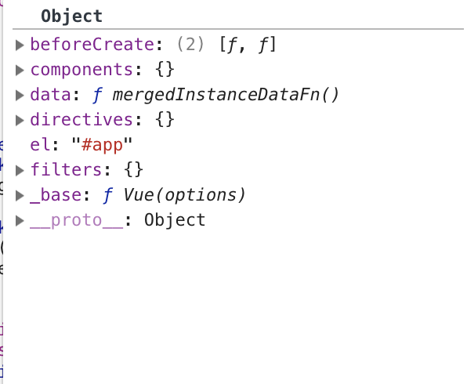

# 说在前面的话
由于整个vue源码层级比较复杂，光看代码很有可能不知道实际发生了什么事、做了什么，所以打算通过调试的方法来观察整个执行的流程，但vue是进行过打包的，直接使用打包过的vue源码也只会摸不着头脑，所以我打算使用未打包的源码，这就带来了问题，vue是使用rollup进行打包的，而我打算使用webpack进行打包构建，所以需要对rollup进行像webpack的迁移（最主要的是文件路径问题）。写了一个脚本来处理文件路径问题。整个项目在这里(https://github.com/breakinferno/Fvue)

**使用方法**
`npm run test`

# 合并配置
顾名思义，这节讲vue初始化时合并配置的行为，我们的关注点在于vue合并了哪些配置项，这些配置项是在哪里声明的。下面我就让我们深入源码来一个一个找出这两个问题的答案吧。虽然没有什么用。废话不多说，让我们来看看源码吧：

```
// merge options
if (options && options._isComponent) {
    // optimize internal component instantiation
    // since dynamic options merging is pretty slow, and none of the
    // internal component options needs special treatment.
    initInternalComponent(vm, options)
} else {
    // 我们的实例必然走这里 
    vm.$options = mergeOptions(
        resolveConstructorOptions(vm.constructor), // 解析构造函数配置
        options || {},  // 用户传入配置项
        vm              // 实例配置项，这里主要是_isVue和uid
    )
}
```
可以看到就我们这个简单的实例其必然走这个else逻辑,我们先来看看里面resolveContructorOptions这个函数吧！
```
// 处理构造器配置项 注意只有子类才有super我们这里简单的例子初始化Ctor.super为undefined，故只返回构造器options属性
export function resolveConstructorOptions (Ctor: Class<Component>) {
  let options = Ctor.options
  if (Ctor.super) {
    const superOptions = resolveConstructorOptions(Ctor.super)
    const cachedSuperOptions = Ctor.superOptions
    if (superOptions !== cachedSuperOptions) {
      // super option changed,
      // need to resolve new options.
      Ctor.superOptions = superOptions
      // check if there are any late-modified/attached options (#4976)
      const modifiedOptions = resolveModifiedOptions(Ctor)
      // update base extend options
      if (modifiedOptions) {
        extend(Ctor.extendOptions, modifiedOptions)
      }
      options = Ctor.options = mergeOptions(superOptions, Ctor.extendOptions)
      if (options.name) {
        options.components[options.name] = Ctor
      }
    }
  }
  return options
}
```

这个函数的名字中文翻译为：**解析构造函数配置项**,我们可以大致猜出这个函数的作用。从代码来看，这个如果构造函数是是Vue时就直接跳过判断逻辑，因为Vue没有super属性，只有其'子类'才有该属性。这里子类具体的来说是使用Vue.extend方法生成构造函数。下面是部分Vue.extend的源码：
<!--sec data-title="extend" data-id="extend" data-collapse=true ces-->
```
  Vue.extend = function (extendOptions: Object): Function {
    extendOptions = extendOptions || {}
    const Super = this
    const SuperId = Super.cid
    const cachedCtors = extendOptions._Ctor || (extendOptions._Ctor = {})
    if (cachedCtors[SuperId]) {
      return cachedCtors[SuperId]
    }

    const name = extendOptions.name || Super.options.name
    if (process.env.NODE_ENV !== 'production' && name) {
      validateComponentName(name)
    }

    const Sub = function VueComponent (options) {
      this._init(options)
    }
    Sub.prototype = Object.create(Super.prototype)
    Sub.prototype.constructor = Sub
    Sub.cid = cid++
    Sub.options = mergeOptions(
      Super.options,
      extendOptions
    )
    Sub['super'] = Super

    // For props and computed properties, we define the proxy getters on
    // the Vue instances at extension time, on the extended prototype. This
    // avoids Object.defineProperty calls for each instance created.
    if (Sub.options.props) {
      initProps(Sub)
    }
    if (Sub.options.computed) {
      initComputed(Sub)
    }

    // allow further extension/mixin/plugin usage
    Sub.extend = Super.extend
    Sub.mixin = Super.mixin
    Sub.use = Super.use

    // create asset registers, so extended classes
    // can have their private assets too.
    ASSET_TYPES.forEach(function (type) {
      Sub[type] = Super[type]
    })
    // enable recursive self-lookup
    if (name) {
      Sub.options.components[name] = Sub
    }

    // keep a reference to the super options at extension time.
    // later at instantiation we can check if Super's options have
    // been updated.
    Sub.superOptions = Super.options
    Sub.extendOptions = extendOptions
    Sub.sealedOptions = extend({}, Sub.options)

    // cache constructor
    cachedCtors[SuperId] = Sub
    return Sub
  }
```
<!--endsec-->

所以只有当我们使用`new Vue.extend()`创建的子类时才会进入这个if逻辑。我们这个例子跳过if逻辑简单返回Vue.options.你可以看上一章来看看Vue.options到底有些啥（components, filters, directives,_base).如果你有兴趣，下面是if逻辑涉及到的另外一个函数。
<!--sec data-title="resolveModifiedOptions" data-id="resolveModifiedOptions" data-collapse=true ces-->
```
function resolveModifiedOptions (Ctor: Class<Component>): ?Object {
  let modified
  const latest = Ctor.options
  const extended = Ctor.extendOptions
  const sealed = Ctor.sealedOptions
  for (const key in latest) {
    if (latest[key] !== sealed[key]) {
      if (!modified) modified = {}
      modified[key] = dedupe(latest[key], extended[key], sealed[key])
    }
  }
  return modified
}
```
<!--endsec-->

此时我们就可以了解到mergeOptions的三个参数了，分别是Vue.options, 用户自定义options, this实例。然后我们在仔细看看mergeOptions做了什么吧。猜想就是合并options：

```
/**
 * Merge two option objects into a new one.
 * Core utility used in both instantiation and inheritance.
 */

export function mergeOptions (
  parent: Object,
  child: Object,
  vm?: Component
): Object {
  if (process.env.NODE_ENV !== 'production') {
    checkComponents(child)                // 检测组件名是否合法，比如有些保留字就不能使用等
  }

  if (typeof child === 'function') {
    child = child.options
  }

  normalizeProps(child, vm) // 规范化属性 比如可能是数组，可能是对象等，具体实现先不管
  normalizeInject(child, vm) // 规范化可注入组件等 具体实现不管
  normalizeDirectives(child) // 规范化指令    具体实现不管
  
  // Apply extends and mixins on the child options,
  // but only if it is a raw options object that isn't
  // the result of another mergeOptions call.
  // Only merged options has the _base property.
  if (!child._base) {
    if (child.extends) {    // 处理extends属性
      parent = mergeOptions(parent, child.extends, vm)
    }
    if (child.mixins) {     // 处理mixins属性
      for (let i = 0, l = child.mixins.length; i < l; i++) {
        parent = mergeOptions(parent, child.mixins[i], vm)
      }
    }
  }
  const options = {}
  let key
  for (key in parent) {
    mergeField(key)
  }
  for (key in child) {
    if (!hasOwn(parent, key)) {
      mergeField(key)
    }
  }
  function mergeField (key) {
    const strat = strats[key] || defaultStrat
    options[key] = strat(parent[key], child[key], vm, key)
  }
  return options
}
```
可以看到，这个函数的目的是为了将后面不只是做了简单的options的合并，还对用户传入的options做了校验以及规范化处理，否则比如面对用户千奇百怪的options格式后面的代码难以处理。还要注意的一点是这里写了个`mergeField`函数用于合并不同的域，而这个函数内部使用的策略模式来对不同的域进行处理，这里strat就是strategy的意思（策略）。比如处理components、filters、directives这种asset类型的属性采用的是`mergeAssets`策略：
```
function mergeAssets (
  parentVal: ?Object,
  childVal: ?Object,
  vm?: Component,
  key: string
): Object {
  const res = Object.create(parentVal || null)
  if (childVal) {
    process.env.NODE_ENV !== 'production' && assertObjectType(key, childVal, vm)
    return extend(res, childVal)
  } else {
    return res
  }
}
```
对于mounted这种生命周期钩子函数采用`mergeHook`策略进行处理：
```
function mergeHook (
  parentVal: ?Array<Function>,
  childVal: ?Function | ?Array<Function>
): ?Array<Function> {
  return childVal
    ? parentVal
      ? parentVal.concat(childVal)
      : Array.isArray(childVal)
        ? childVal
        : [childVal]
    : parentVal
}
```
妙啊妙啊！！

最后从逻辑来看，mergeOptions流程的合并是合并parent属性和child中非parent属性（观察mergeField可知是为了防止重复调用，因为结果相同的），而不同属性对应的合并策略又有很大的不同。最后你会发现components居然没有KeepAlive了(*@ο@*)

最后处理结果是：


最后的最后把处理的结果给vm的$options属性。同样的把见过的实例属性记在[小本本](/book/extra/vue_instance.md)上。

总结：初始化的配置项合并就是合并公用api和用户传入配置，其中包括指令、组件、mixins、extends等，并将合并结果挂载到实例的$options属性上。