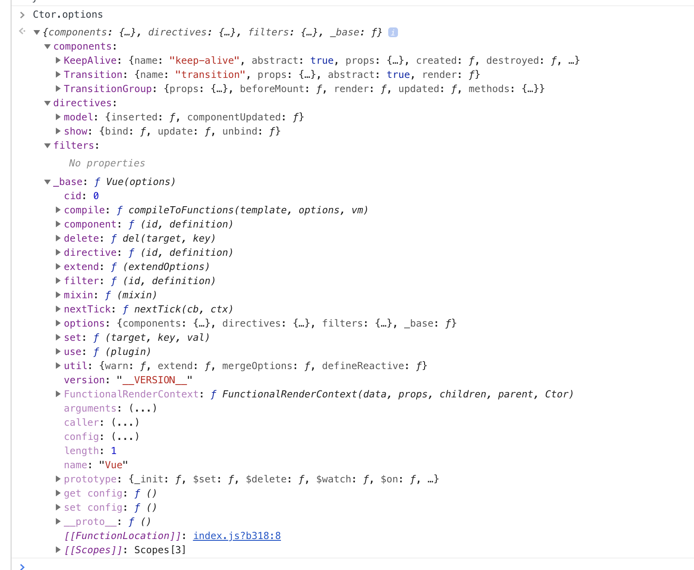

# 说在前面的话
由于整个vue源码层级比较复杂，光看代码很有可能不知道实际发生了什么事、做了什么，所以打算通过调试的方法来观察整个执行的流程，但vue是进行过打包的，直接使用打包过的vue源码也只会摸不着头脑，所以我打算使用未打包的源码，这就带来了问题，vue是使用rollup进行打包的，而我打算使用webpack进行打包构建，所以需要对rollup进行像webpack的迁移（最主要的是文件路径问题）。写了一个脚本来处理文件路径问题。整个项目在这里(https://github.com/breakinferno/Fvue)

**使用方法**
`npm run test`

# 合并配置
顾名思义，这节讲vue初始化时合并配置的行为，我们的关注点在于vue合并了哪些配置项，这些配置项是在哪里声明的。下面我就让我们深入源码来一个一个找出这两个问题的答案吧。虽然没有什么用。废话不多说，让我们来看看源码吧：

```
// 这里就是主要的代码了
vm.$options = mergeOptions(
    resolveConstructorOptions(vm.constructor),  // 原型配置，主要是一些全局的公用配置，比如global api
    options || {},  // 用户传入配置项
    vm              // 实例配置项，这里主要是_isVue和uid
)

/**
 * Merge two option objects into a new one.
 * Core utility used in both instantiation and inheritance.
 */
export function mergeOptions (
  parent: Object,
  child: Object,
  vm?: Component
): Object {
  if (process.env.NODE_ENV !== 'production') {
    checkComponents(child)                // 检测组件名是否合法，比如有些保留字就不能使用等
  }

  if (typeof child === 'function') {
    child = child.options
  }

  normalizeProps(child, vm) // 规范化属性 比如可能是数组，可能是对象等
  normalizeInject(child, vm) // 规范化可注入组件等
  normalizeDirectives(child) // 规范化指令
  
  // Apply extends and mixins on the child options,
  // but only if it is a raw options object that isn't
  // the result of another mergeOptions call.
  // Only merged options has the _base property.
  if (!child._base) {
    if (child.extends) {    // 处理extends属性
      parent = mergeOptions(parent, child.extends, vm)
    }
    if (child.mixins) {     // 处理mixins属性
      for (let i = 0, l = child.mixins.length; i < l; i++) {
        parent = mergeOptions(parent, child.mixins[i], vm)
      }
    }
  }

// 处理构造器配置项
export function resolveConstructorOptions (Ctor: Class<Component>) {
  let options = Ctor.options
  if (Ctor.super) {
    const superOptions = resolveConstructorOptions(Ctor.super)
    const cachedSuperOptions = Ctor.superOptions
    if (superOptions !== cachedSuperOptions) {
      // super option changed,
      // need to resolve new options.
      Ctor.superOptions = superOptions
      // check if there are any late-modified/attached options (#4976)
      const modifiedOptions = resolveModifiedOptions(Ctor)
      // update base extend options
      if (modifiedOptions) {
        extend(Ctor.extendOptions, modifiedOptions)
      }
      options = Ctor.options = mergeOptions(superOptions, Ctor.extendOptions)
      if (options.name) {
        options.components[options.name] = Ctor
      }
    }
  }
  return options
}
// 处理可更改配置项
function resolveModifiedOptions (Ctor: Class<Component>): ?Object {
  let modified
  const latest = Ctor.options
  const extended = Ctor.extendOptions
  const sealed = Ctor.sealedOptions
  for (const key in latest) {
    if (latest[key] !== sealed[key]) {
      if (!modified) modified = {}
      modified[key] = dedupe(latest[key], extended[key], sealed[key])
    }
  }
  return modified
}
```
由于`resovleContructorOptions`函数接受的构造器初始化时没有super参数所以返回的就是构造器的配置项，我们可以看到此时其配置有：

可以看到此时公共api可以使用，还注入了部分组件，比如KeepAlive，Transition。我们再把主要目光放到mergeOptions上，可以发现，它的执行流程是检查用户传入组件，props属性,inject属性，指令等,还有如果用户传入的属性有mixins和extend字段，则也会将其合并到实例的$options属性上。

总结：初始化的配置项合并就是合并公用api和用户传入配置，其中包括指令、组件、mixins、extends等，并将合并结果挂载到实例的$options属性上。